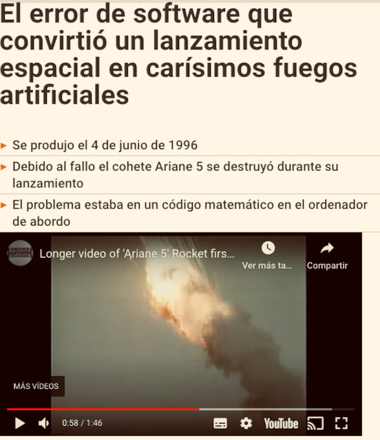
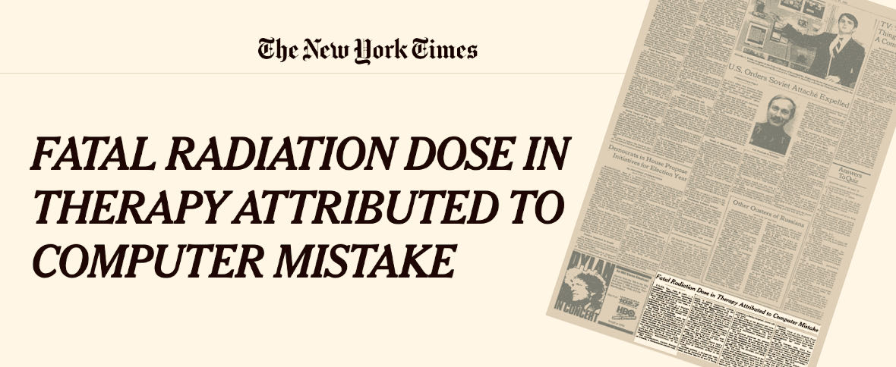

## Consecuencias de errores de software a lo largo de la historia

Para ver la importancia de tener software sin errores hemos visto algunas de las consecuencias más sonadas producidas por un error en el software. Hay más, pero a continuación dejamos 4 de ellas como curiosidad con enlaces para leer más información al respecto.

### Satélite Ariane

|:-----:|:------|
|           |Es un satélite que ha experimentado diversos errores a lo largo del tiempo. Por ejemplo, en 1996 sufrió una explosión y en 2018 se desvió de la ruta establecida. Ambos por errores en el software (según dicen) [Veinte años de la explosión del primer Ariane 5 por un fallo de software](https://www.microsiervos.com/archivo/espacio/veinte-anos-explosion-primer-ariane-5-por-fallo-software.html){:target="_blank"} [Un error en una cifra provocó el incidente de la misión VA241 del Ariane 5](https://danielmarin.naukas.com/2018/02/25/un-error-en-una-cifra-provoco-el-incidente-de-la-mision-va241-del-ariane-5/){:target="_blank"}|

### Therac-25 sobreexposición de pacientes a radiación

|:-----:|:-----|
| | Se trataba de una máquina para radiar a pacientes oncológicos. Al parece algún problema hizo que se produjesen situaciones no controladas, que originaron que se diesen varias radiaciones a los pacientes. Algunos de ellos fallecieron. [Fata radiation dose in therapy attributed to computer mistake](https://www.nytimes.com/1986/06/21/us/fatal-radiation-dose-in-therapy-attributed-to-computer-mistake.html?searchResultPosition=1){:target="_blank"} [Killed by a machine: the Therac-25](https://hackaday.com/2015/10/26/killed-by-a-machine-the-therac-25/){:target="_blank"} [Accidentes Therac-25](https://lsi2.ugr.es/mvega/docis/aluwork/roddesastres/therac.htm){:target="_blank"}
|
